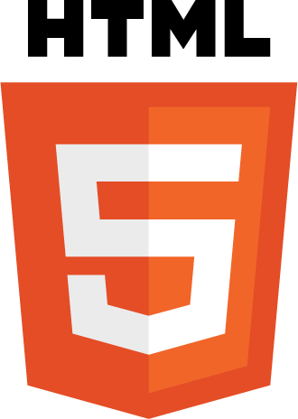
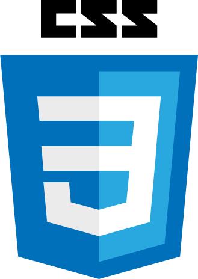
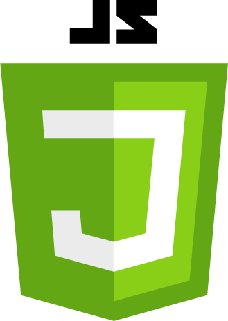
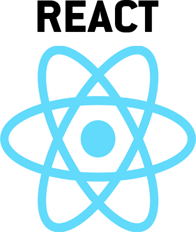

# Hi, I'm P-Oliomonte
## I'm currently learning frontend WebDev at neue fische

Here's my **[website](https://phillip-oehlenberg.com/)** from my former life as graphic designer.

My new passion is programming and I'm looking forward for new challenges in this domain.\
I'm going to learn:

 &nbsp; &nbsp;
 &nbsp; &nbsp;
 &nbsp; &nbsp;

